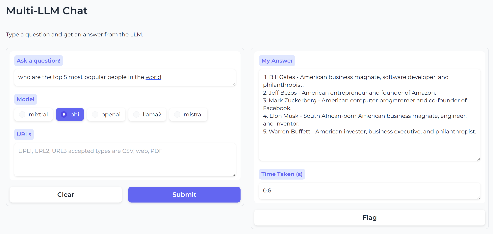

# Multi-LLM Chat



This application provides the ability to query a collection of LLM models via a web 
based interface. Optionally users can provide URL(s) in the form of web sites, PDFs or CSVs which will be fed to the LLM of choice for additional context. Multi-LLM Chat currently supports the following LLM models:

* OpenAI (gpt-3.5 turbo)
* Phi-2
* Llama2

Inference for OpenAI is provided via Azure's AI OpemAPI endpoint, other models are hosted via Ollama. Running instructions include both local (quickstart) as well as Azure Container App.


## Quickstart

This sections assumes the following requirements are met:
- You have a host which has Docker and CUDA configured (GPU support will be needed for local model inference)
- You have Azure OpenAI credentials and endpoint specified in `.env`.

```
# Run the backend
docker run -d -p 8088:8080 -e OPENAI_API_KEY=<YOUR_AZURE_OPENAI_KEY> simonj.azurecr.io/aca-multi-llm-backend

# Run the frontend
docker run -d -p 8088:8088 -e BACKEND_URL=http://localhost:8080 simonj.azurecr.io/aca-multi-llm-frontend

# Run the model-endpoint
# we store models on host filesystem under ollama-models
docker run -d -p 11434:11434  -v `pwd`/ollama-models:/root/.ollama --gpus=all --name ollama ollama/ollama 

# Download needed models to Ollama
docker exec -it ollama ollama pull phi
docker exec -it ollama ollama pull llama2
```
You should be able to access the application at `http://localhost:8088` now.


## Application Details

The application is composed of three different microservices each hosted and run as Docker containers. 

### Frontend

The application frontend is written in Python and uses [Gradio](https://grad.io). It renders the UI as well as shuttles in/output between the user and the backend. By default the application runs on port `8088` and requires the environment variable `BACKEND_URL` in order to function (the default value is `http://localhost:8080`).

### Backend

The application backend is written in Python and uses [FastAPI](https://fastapi.org). It acts as middleware to broker frontend data between Azure OpenAI or the Ollama model endpoint depending on user choices. By defailt the backend listens on port `8080`.

Secrets and settings are handled via environment files and/or command line `ENV` variables (command line variables overwrite file based variables). Secrets should be provided via command line inpts but can also be added to `.env.secret`.
Non-secret settings can be added to `.env` or similalry provided on the command line.

The backend requires the following settings:
* `AZURE_OPENAI_ENDPOINT=https://<YOUR_INSTANCE_ID>.openai.azure.com/`
* `AZURE_OPENAI_API_VERSION=2024-02-15-preview` (March '24 version but might change)
* `MODEL_DEPLOYMENT_NAME=<CHAT_AGENT_DEPLOYMENT_NAME>` (configured during Azure OpenAI setup)
* `OLLAMA_BASE_URL=http://localhost:11434` (endpoint for Ollama)
* `OPENAI_API_KEY=<YOUR_AZURE_OPENAI_KEY>`

For setup instructions on how to configure and retrieve the above Azure OpenAI details please see [TODO](TODO).

### Model Endpoint

For all other models outside of OpenAI we utilize [Ollama]() running on a GPU. Ollama hosts as well as manages the different models and conveniently runs in a Docker container. When running locally make sure to pass the needed `--gpus=all` flag when starting the container (see more below). Ollama listens on port `11434`.

In order for different models to be hosted and provided as part of the Multi-LLM Chat we need to tell Ollama which model to download first. We do this by running: `ollama pull <MODEL_NAME>`. Multi-LLM Chat currently supports `openai`, `llama2` and `phi`. It is relatively easy to add additional or other models (instructions pending). The full model inventory is available at [TODO](TODO). For detailed running instructions please see below.


## Running

### Azure Container Apps

In order to running this application on a Azure Container Apps we setup a new environment with a GPU workload profile. While frontend and backend can run on a consumption profile it is essential to run the model endpoint (Ollama) on GPU.

1. Set Environment Variables
Make sure you have GPU quota allocated in whichever location you specifiy.
    ```
    export ACA_ENV=multi-llm
    export RG=llm-playground
    export LOCATION=westus3
    ```
1. Create Container Apps Environment and GPU Workload Profile
The GPU profile will automatically recevie the profile name `gpu`.
    ```
    az containerapp env create \
            --name $ACA_ENV \
            --resource-group $RG \
            --location $LOCATION \
            --enable-dedicated-gpu \
            --enable-workload-profiles
    ```
1. Standup the Backend
Assuming we provided the majority of our settings as part of `.env` we only need to inject the `OPENAI_API_KEY`. The `OLLAMA_BASE_URL` is set to `http://model-endpoint` below. There is no need to change that unless, you use a differnt name for the app below when setting up the model endpoint. Also note: Ollama's usual default port of `11434` is not used because Container App's internal ingress handling.
    ```
    az containerapp create \
            --name backend-service-multi-llm \
            --resource-group $RG \
            --environment $ACA_ENV \
            --cpu 2 --memory 4Gi \
            --image simonj.azurecr.io/aca-multi-llm-backend \
            --min-replicas 1 --max-replicas 1 \
            --target-port 8080 --ingress internal \
            --env-vars \
            OLLAMA_BASE_URL=http://model-endpoint \
            OPENAI_API_KEY=<YOUR_AZURE_OPENAI_KEY>   
    ```
1. Standup the Frontend
No changes should be required, unless you've changed the name of the backend app. In which case you will need to adjust `BACKEND_URL` accordingly.
    ```
    az containerapp create \
            --name frontend-service-multi-llm \
            --resource-group $RG \
            --environment $ACA_ENV \
            --cpu 4 --memory 8Gi \
            --image simonj.azurecr.io/aca-multi-llm-frontend \
            --min-replicas 1 --max-replicas 1 \
            --target-port 8088 --ingress external \ 
            --env-vars \
            BACKEND_URL=http://backend-service-multi-llm
    ```
1. Standup the Model Endpoint
We make sure that Ollama runs on our GPU workload profile by using the command below.
    ```
    az containerapp create \
            --name model-endpoint \
            --resource-group $RG \
            --environment $ACA_ENV \
            --workload-profile-name gpu \
            --cpu 12 --memory 24Gi \
            --image ollama/ollama \
            --min-replicas 1 --max-replicas 1 \
            --target-port 11434 \
            --ingress internal
    ```
After the model container comes up we need to ensure our models get deployed. Currently this is a manual process where we instruct Ollama to pull the models and make them available for eventual inference requests via it's API. In order to download the models we use the `ollama` CLI. From the CLI we can run the commands below. Alternatively we can use the portal's web console to run the commands.
    ```
    az containerapp exec \
            --name model-endpoint \
            --resource-group $RG \
            --container model-endpoint \
            --command 'ollama pull phi'

    az containerapp exec \
            --name model-endpoint \
            --resource-group $RG \
            --container model-endpoint \
            --command 'ollama pull llama2'
    ```

## Limitations & Todo
* Multi-Chat LLM is not intended for production use.
* Dependencies should be moved from Dockerfile to requirements.txt.
* Logging should be moved to logging library.
* Enabling different/more models should be easier.
* Dynamic Ollama initialization and model discovery should be enabled.
* Troubleshooting section should be added to documentation.